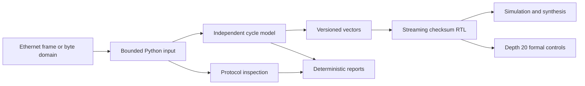

# FPGA Packet Checksum Offload

This repository is a protocol-aware checksum reference that joins strict Python inspection software to a synthesizable 64-bit SystemVerilog streaming core. It calculates Internet checksums, inspects Ethernet II/IPv4/UDP/TCP frames, models cycle-accurate ready/valid behavior independently from the RTL, and publishes reproducible simulation, synthesis, formal, CLI, and package evidence.



## Quick start

```bash
python -m pip install -e ".[dev]"
checksum-offload checksum 0001f203 --seed 0x10
checksum-offload inspect 00112233445566778899aabb0800450000211234400040113c61c0000201c63364023039d431000d062c0102030405
checksum-offload batch examples/frames.jsonl --format markdown
checksum-offload campaign
```

The software boundary supports Ethernet II with zero, one, or two VLAN tags; IPv4 headers including options; and IPv4 UDP/TCP pseudo-header verification. IPv6, fragment reassembly, tunnel decapsulation, checksum insertion, DMA/MAC integration, physical timing closure, device-specific line rate, and production deployment are not claimed.

## Evidence

| Layer | Checked behavior | Reproduction |
| --- | --- | --- |
| Arithmetic | Network order, odd-byte padding, carry folding, seed, incremental update | `python -m pytest tests/test_arithmetic.py -q` |
| Protocol | Ethernet II, VLAN, IPv4 options, UDP/TCP, fragments, malformed lengths | `python -m pytest tests/test_packet.py -q` |
| Input/reports | Bounded strict JSONL, deterministic JSON/Markdown, durable atomic writes | `python -m pytest tests/test_trace_io.py tests/test_reporting.py -q` |
| Cycle model | Framing, masks, stalls, reset, zero-bubble replacement, overflow | `python -m pytest tests/test_cycle_model.py tests/test_campaign.py -q` |
| RTL | Verilator lint, Icarus vectors, invalid parameters, Yosys synthesis | `REQUIRE_HDL_TOOLS=1 python -m pytest tests/test_rtl_contract.py -q` |
| Formal | Positive and cover depth 20; two targeted negative mutations | `sby -f formal/checksum16_stream.sby positive` |
| Distribution | Wheel/source contents, Twine, extracted source, isolated wheel CLI | `python -m pytest tests/test_package_contract.py -q` |

## Streaming contract

`rtl/checksum16_stream.sv` accepts 64-bit request data, an eight-bit `keep` mask, `first`, `last`, and an uncomplemented 16-bit seed. Bytes are consumed from ascending lanes in network order. Non-final beats require `keep == 8'hff`; a final beat requires a nonzero contiguous mask from lane zero. The output register holds checksum, folded sum, byte length, and one of six statuses:

| Value | Status | Meaning |
| ---: | --- | --- |
| 0 | `SUCCESS` | Packet checksum completed |
| 1 | `MISSING_FIRST` | Idle core received a beat without `first` |
| 2 | `UNEXPECTED_FIRST` | Active packet received another `first` |
| 3 | `INVALID_KEEP` | A non-final or final mask violated the contract |
| 4 | `EMPTY_FINAL` | Final beat contained no valid bytes |
| 5 | `LENGTH_OVERFLOW` | Accepted bytes exceeded the configured counter |

Response fields remain stable while stalled. A response can retire while the first beat of the next packet is accepted, providing zero-bubble replacement without claiming a device frequency or throughput.

## CLI policy

The module entry point and `checksum-offload` command expose separate `checksum`, `inspect`, `batch`, and `campaign` subcommands. JSON is the default; Markdown or concise text is available where applicable. Exit code `0` means the operation completed and all applicable checks passed, `1` means a report completed but an expected value, packet checksum, batch record, or campaign case failed, and `2` means input, structure, or I/O prevented a completed report. Disabled UDP checksums, incomplete fragmented transport checksums, and non-applicable transport checks are reported explicitly and do not by themselves produce exit code `1`.

See [architecture](docs/architecture.md), [protocol boundary](docs/protocol-boundary.md), [formal verification](docs/formal-verification.md), [operations](docs/operations.md), [threat model](docs/threat-model.md), and [verification methodology](docs/verification-methodology.md) for the complete evidence boundary.

## License

MIT. See [LICENSE](LICENSE).
