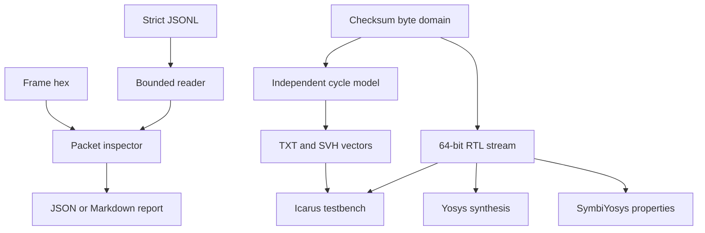

# Architecture

## Separation of responsibilities

The implementation uses narrow modules so protocol interpretation never becomes implicit RTL behavior.

1. `arithmetic.py` owns 16-bit one's-complement arithmetic over byte domains, incremental accumulation, IPv4 pseudo-header seeds, residue checks, and RFC 1624 word replacement.
2. `packet.py` bounds and interprets Ethernet II, VLAN, IPv4, UDP, and TCP structures. It returns immutable inspection records with explicit checksum states.
3. `trace_io.py` accepts a strict bounded JSONL envelope. `reporting.py` converts inspections to deterministic JSON or inert Markdown and performs durable atomic replacement.
4. `cycle_model.py` independently models the ready/valid interface. It does not call the arithmetic checksum API. `campaign.py` drives named behaviors, and `tools/generate_rtl_vectors.py` produces the versioned vector snapshot.
5. `checksum16_stream.sv` implements the general byte-domain accumulator. `ipv4_pseudo_header_seed.sv` reduces protocol metadata into a seed. The RTL does not parse Ethernet or IPv4 headers.
6. Simulation, Yosys synthesis, and SymbiYosys formal tasks consume the same public contract through independent checks.

## Dataflow

## Ready/valid semantics

Inputs are requests observed before a rising edge; cycle-model observations describe state and response after that edge. A transfer occurs only when request valid and request ready are both asserted. Reset is synchronous and dominant. While a response is valid and response ready is low, every response field and packet state remains stable and request ready is low. When response ready is high, a new first beat may be accepted on the same edge that retires the prior response.

The seed is sampled only on a valid first beat. Data bytes occupy ascending lanes, and `keep` indicates a contiguous prefix on the final beat. Odd data domains append a zero low-order byte for checksum pairing. Any framing or mask error terminates the current packet with a status record so the following packet begins from clean state.

## Integration boundary

Software decides which bytes belong to the IPv4 header or UDP/TCP checksum domain and supplies any pseudo-header seed. A MAC, DMA engine, parser pipeline, clock-domain crossing, and checksum insertion stage are outside this core. Those integrations must add buffering, reset synchronization, host protection, device constraints, and timing closure evidence.
